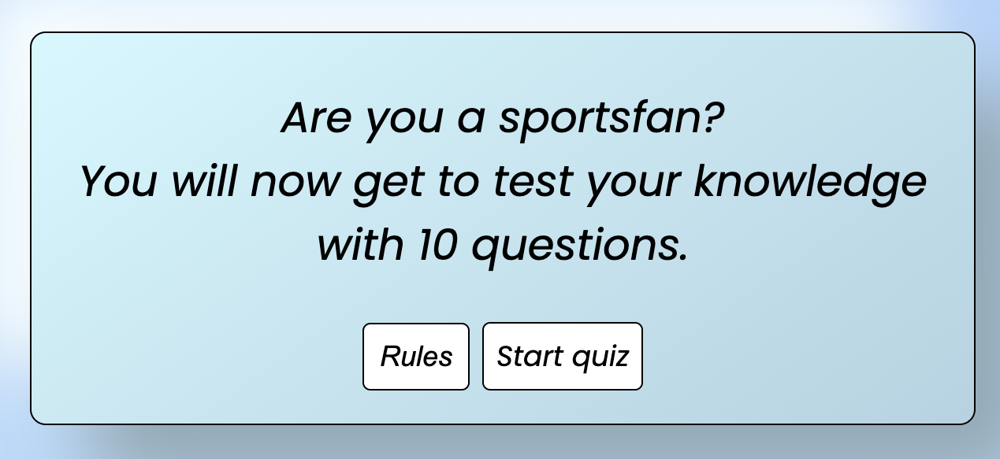

# Sports quiz

## Homepage
* Header 
   * On top of the page is the title 
   * This tells the user what the page is about

* Body 
   * Here the user see a window with what to expect
   * The quiz will start by clicking on the "start quiz" button
   * When clicking on the rules button a window will appear with rules for the game

## Quizpage

*

## Favicon

* The favicon is a football so that the user easily can navigate to the site when multible tabs are open

## Lighthouse
