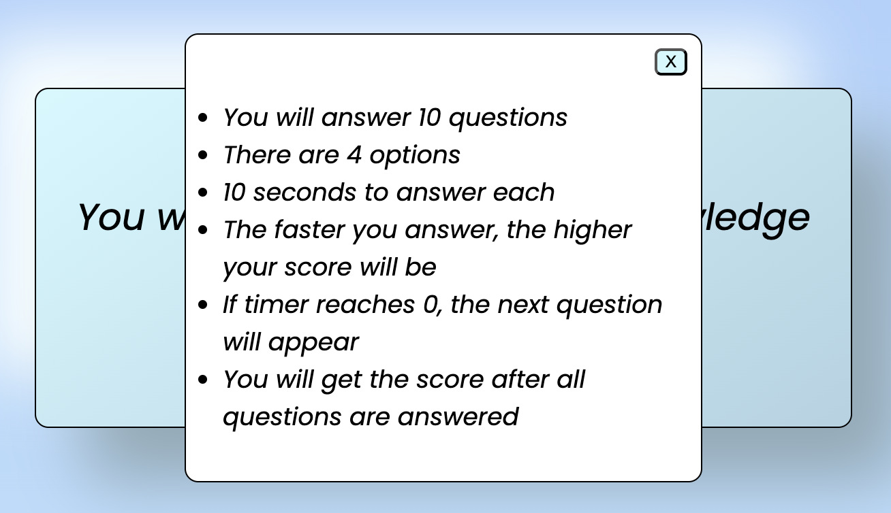
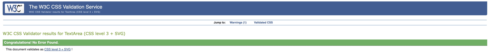

# Sports quiz
* This sports quiz is a fun game for everyone interested in sports. The quiz will test the user under pressure because of the timer and it´s impact on the result. It´s not enough to know the answers. The user must be quick.

## Homepage
### Header 
   * On top of the page is the title 
   * This tells the user what the page is about

### Body 
   * Here the user see a window with what to expect
   * The quiz will start by clicking on the "start quiz" button
   * When clicking on the rules button a window will appear with rules for the game

### Rules

## Quizpage
### Header 
* On top of the page is the title 

### Body 
* Quiz has started
* The timer starts immediately when the question appears
* The user now have 4 options
* By clicking on the correct answer, a popup message appears that says "Correct!"
* By clicking on the incorrect answer, a popup message appears that says "Incorrect!"
* The faster the user answers, the higher the score

### Score
* The score will appear when the last question is answered or the timer goes to 0

## Favicon

* The favicon is a football so that the user easily can navigate to the site when multible tabs are open

## Testing browsers and responsiveness

* The quiz is tested on browsers Safari, Edge, Firefox and Google chrome. It is also tested on both Samsung and Iphone

## Validator testing 
### HTML
* index.html
  *  No errors where found using [W3C VALIDATOR](https://validator.w3.org/)

  

* quiz.html
  *  No errors where found using [W3C VALIDATOR](https://validator.w3.org/) 

  

### CSS
* style.css
  *  No errors where found but one warning using [Jigsaw Validator](https://jigsaw.w3.org/css-validator/)  

  
  

### JAVASCRIPT
* script.js
  * No errors where found using [Jshint Validator](https://jshint.com/)  

  

* rules.js
  * No errors where found using [Jshint Validator](https://jshint.com/) 

    

## Lighthouse testing

### index.html

### quiz.html

## Manual testing

| Action | Expectation | Result|
| --- | --- | --- |
| Press rules button | Rules window appears | Rules window appears | 
| Press rules closing button | Rules window disappears | Rules window disappears | 
| Press start quiz | Quiz starts | Quiz starts | 
| Press answer button | popup window appears and the next question appears |popup window appears and the next question appears | 
| Press play again button | Quiz restarts | Quiz restarts |
| Press home button | User is directed to home.html | User is directed to home.html |

## Bugs 
* An error message appeared (GET https://8000-patteerrik-sportsquiz-4sb3rr13zvr.ws-eu110.gitpod.io/assets/favicon/site.webmanifest 404 (Not Found))
* It was solved with removing a link(link rel="manifest" href="assets/favicon/site.webmanifest") in my html.

## Features left to implement

* Function to add different questions every new game
* Function to save highscore and username

## Deployment

* This site was deployed to Github pages.
  * Go to the settings tab in Github repository
  * Select pages on the menu on the left side navigation bar 
  * In the Build and deployment section set the source to deploy from a branch and set the branch to main and root
  * Click save
  * Your site is now deployd to Github 
  * The live link can be found here [Sports quiz!](https://patteerrik.github.io/sports-quiz/)

## Credits

* [Favicon.io](https://favicon.io/) was used to create the favicon
* [Fontawesome](https://fontawesome.com/) was used for all fonts
* [Am I responsive](https://ui.dev/amiresponsive) was used along with Google chrome devtools to see how the site looked on various devices
* A big credit to
  * My mentor Gareth McGirr
  * John from code institute